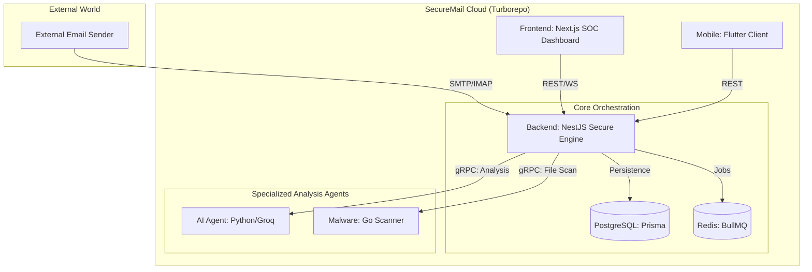

## 🛡️ The SecureMail Mission
SecureMail is a production-grade, distributed security infrastructure designed to modernize email protection. It integrates static rule engines, high-performance binary scanning, and state-of-the-art AI reasoning into a unified, high-concurrency monorepo.

## 🏗️ Ecosystem Architecture
The system is built on a "Defense in Depth" strategy where multiple specialized microservices collaborate to provide a 360-degree security verdict for every ingested email.



## 🧩 Microservice Interconnectivity

| Component | Technology | Role | Communication |
| :------- | :------- | :--- | :----------- |
| **SecureMail-Backend** | NestJS/TS | Logic Orchestrator | REST (API), WebSocket (Live), gRPC (Client) |
| **SecureMail-Frontend** | Next.js 16 | SOC Dashboard | REST / WebSocket Client |
| **SecureMail-Ai** | Python/Groq | Deep AI Reasoning | gRPC Server |
| **SecureMail-Malware** | Go 1.24 | Binary Scanning | gRPC Server |
| **SecureMail-Flutter** | Flutter/Dart | Mobile Security UX | REST API Client |

---

## 🚀 Getting Started (Run Everything Together)

There are two primary ways to run the full stack:

### Method A: Turborepo (Recommended for Development)
High-performance parallel orchestration of all services in a single terminal.

1. **Start Infrastructure**:
   ```bash
   docker compose up -d postgres redis
   ```
2. **Launch All Services**:
   ```bash
   npm run dev  # Or pnpm dev
   ```
   *Available Filters:*
   - `npm run dev:api`: Runs only Backend + AI + Malware.
   - `npm run dev:ui`: Runs only the Frontend.

### Method B: Docker Compose (Production-Like)
Ideal for testing the entire environment with container isolation.

```bash
docker compose up --build
```
> [!IMPORTANT]
> Ensure you have configured your `.env` from `.env.docker.example` at the root.

---

## 🛠️ Individual Service Execution

If you wish to run a specific service manually for debugging:

| Service | Manual Command | Default Port |
|---------|----------------|--------------|
| **Backend** | `npm run start:dev` (in Backend folder) | `3000` |
| **Frontend** | `npm run dev` (in Frontend folder) | `3001` |
| **AI Agent** | `python app/main.py` (in AI folder) | `50051` |
| **Malware** | `go run main.go` (in Malware folder) | `50052` |
| **Flutter** | `flutter run` (in Flutter folder) | - |

---

## 🔗 Internal Wiring & URLs

| What | URL |
|------|-----|
| **REST API + Swagger** | http://localhost:3000/api/docs |
| **Web Dashboard** | http://localhost:3001 |
| **Flutter Web** | http://localhost:8080 (via Docker) |
| **Postgres** | `localhost:5432` |
| **Redis** | `localhost:6379` |

---

## 📄 Sub-Project Documentation

For deep dives into configuration and requirements, see individual READMEs:
- [Backend Documentation](https://github.com/The-Team-Dream/SecureMail-Backend/blob/f318f64449153b2469f1ce116c13dc7d1ab06945/README.md)
- [AI Service Documentation](./SecureMail-Ai/README.md)
- [Malware Service Documentation](https://github.com/The-Team-Dream/SecureMail-Malware/blob/03c2dfca222efbf3eb9dc6793251725141c541f0/README.md)
- [Frontend Documentation](https://github.com/The-Team-Dream/SecureMail-Frontend/blob/f649dda9278e9f6d60a0ec8b20acca2d84b0caf5/README.md)
- [Flutter Documentation](https://github.com/The-Team-Dream/SecureMail-Flutter/blob/efa6c6eeb9bc9242027073f491fbe69686b28292/README.md)
- [Contracts Documentation](./contracts/README.md)

## 👥 Team Leadership

- **Swilam** - Project Team Leader

