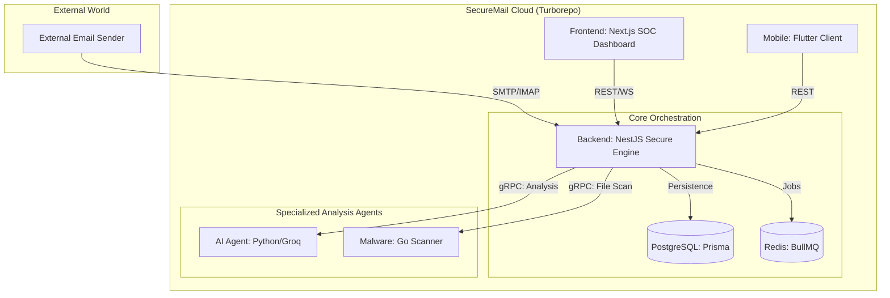

# SecureMail 🛡️

> A production-grade, distributed email security platform built on a "Defense in Depth" strategy — integrating static rule engines, high-performance binary scanning, and state-of-the-art AI reasoning into a unified high-concurrency system.

---

## 📋 Table of Contents

- [Ecosystem Architecture](#-ecosystem-architecture)
- [Microservices Overview](#-microservices-overview)
- [Quick Start — Full Stack](#-quick-start----full-stack)
- [What Does the Setup Script Do?](#-what-does-the-setup-script-do)
- [Development Mode (Turborepo)](#-development-mode-turborepo)
- [Individual Service Execution](#-individual-service-execution)
- [Internal URLs & Ports](#-internal-urls--ports)
- [Sub-Project Documentation](#-sub-project-documentation)

---

## 🏗️ Ecosystem Architecture

The system is built as a **Turborepo monorepo** where specialized microservices collaborate to deliver a 360-degree security verdict for every ingested email.



---

## 🧩 Microservices Overview

| Service | Technology | Role | Communication |
|---|---|---|---|
| **SecureMail-Backend** | NestJS / TypeScript | Core orchestrator & security pipeline | REST, WebSocket, gRPC client |
| **SecureMail-Frontend** | Next.js 16 | SOC Dashboard for end-users | REST / WebSocket |
| **SecureMail-Ai** | Python / Groq | Deep AI threat reasoning | gRPC server |
| **SecureMail-Malware** | Go 1.24 | Binary attachment scanning | gRPC server |
| **SecureMail-Flutter** | Flutter / Dart | Mobile security client | REST |

---

## 🚀 Quick Start — Full Stack

### Prerequisites

- **Docker Desktop** installed and running → [Download here](https://www.docker.com/products/docker-desktop/)
- **Git** installed → [Download here](https://git-scm.com/)

---

### Step 1 — Clone all repositories

```bash
git clone https://github.com/The-Team-Dream/Securemail.git
cd Securemail
git submodule update --init --recursive
```

---

### Step 2 — Run the setup script

**On Windows** — double-click `setup.bat` or run in terminal:
```
setup.bat
```

**On Mac / Linux:**
```bash
chmod +x setup.sh
./setup.sh
```

---

### Step 3 — Done ✅

| | URL |
|---|---|
| **Web Dashboard** | http://localhost:3001 |
| **REST API** | http://localhost:3000 |
| **Swagger Docs** | http://localhost:3000/api/docs |
| **Health Check** | http://localhost:3000/health |

---

## 🔧 What Does the Setup Script Do?

```
┌──────────────────────────────────────────────────────────────┐
│               setup.sh / setup.bat                           │
├──────────────────────────────────────────────────────────────┤
│                                                              │
│  ① Checks that Docker is running                             │
│     └── If not → tells you to start Docker Desktop          │
│                                                              │
│  ② Verifies all service folders exist                        │
│     └── Backend, Frontend, Ai, Malware                      │
│                                                              │
│  ③ Creates .env.docker files from examples                   │
│     └── One per service, only if they don't exist yet        │
│                                                              │
│  ④ Asks you for a PostgreSQL password                        │
│     └── Press Enter → uses "0000" as default                 │
│     └── Type anything → uses what you typed                  │
│                                                              │
│  ⑤ Writes the password into two places:                      │
│     └── Root .env  → docker-compose.yml reads it            │
│     └── SecureMail-Backend/.env.docker → DATABASE_URL        │
│                                                              │
│  ⑥ Reminds you about optional secrets                        │
│     └── GROQ_API_KEY, SMTP, OAuth, Cloudinary, etc.         │
│                                                              │
│  ⑦ Starts Docker Compose                                     │
│     └── Builds all images                                    │
│     └── Starts all 6 containers in the correct order        │
│                                                              │
│  ⑧ Waits for the backend to be ready                        │
│     └── Watches for Prisma migrations to complete            │
│                                                              │
│  ⑨ Prints the final URLs                                     │
│                                                              │
└──────────────────────────────────────────────────────────────┘
```

---

## 🛠️ Development Mode (Turborepo)

Use this for active coding with hot reload across all services.

**Prerequisites:** Node.js v22+, pnpm, Go 1.24+, Python 3.11+, Docker (for postgres & redis)

```bash
# Start infrastructure only
docker compose up -d postgres redis

# Run all services in parallel
pnpm dev

# Or run specific groups
pnpm dev:api     # Backend + AI + Malware
pnpm dev:ui      # Frontend only
```

---

## ⚙️ Individual Service Execution

For debugging a specific service in isolation:

| Service | Command | Port |
|---|---|---|
| **Backend** | `pnpm start:dev` inside `SecureMail-Backend/` | `3000` |
| **Frontend** | `pnpm dev` inside `SecureMail-Frontend/` | `3001` |
| **AI Agent** | `python app/main.py` inside `SecureMail-Ai/` | `50051` |
| **Malware** | `go run main.go` inside `SecureMail-Malware/` | `50052` |
| **Flutter** | `flutter run` inside `SecureMail-Flutter/` | — |

---

## 🔗 Internal URLs & Ports

| Service | URL / Address |
|---|---|
| **REST API + Swagger** | http://localhost:3000/api/docs |
| **Web Dashboard** | http://localhost:3001 |
| **Flutter** | Mobile emulator |
| **PostgreSQL** | `localhost:5432` |
| **Redis** | `localhost:6379` |
| **AI gRPC** | `localhost:50051` (internal only) |
| **Malware gRPC** | `localhost:50052` (internal only) |

---

## 📄 Sub-Project Documentation

Each service has its own README with detailed configuration and setup instructions:

- [Backend Documentation](./SecureMail-Backend/README.md)
- [AI Service Documentation](./SecureMail-Ai/README.md)
- [Malware Service Documentation](./SecureMail-Malware/README.md)
- [Frontend Documentation](./SecureMail-Frontend/README.md)
- [Flutter Documentation](./SecureMail-Flutter/README.md)
- [Contracts Documentation](./contracts/README.md)

---

## ⚠️ Troubleshooting

### AI service is unhealthy

The `nc` command isn't available in the Python image. The healthcheck uses Python's socket module instead — this is already handled in the `docker-compose.yml`.

### Backend fails to connect to database

```bash
docker compose down -v
./setup.sh
```

### View logs for a specific service

```bash
docker compose logs -f backend
docker compose logs -f ai
docker compose logs -f malware
docker compose logs -f frontend
```

### Stop everything

```bash
docker compose down        # Stop containers
docker compose down -v     # Stop + delete all data
```

---

Built with ❤️ by the SecureMail Team — Led by **Swilam**
